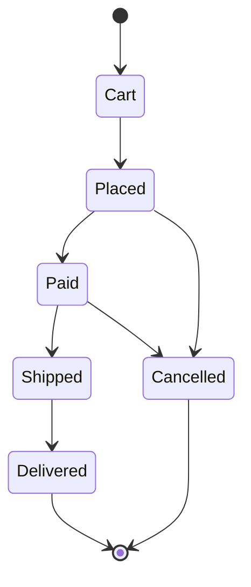

+++
title = "Typed Lifecycles"
description = "Autumn's #[lifecycle] attribute turns a plain enum into a typestate machine whose illegal transitions are a compile error. You declare the states, the initial state, the terminal states, and every legal edge once, on the enum; the macro generates a metadata surface plus a per-enum module of zero-cost marker types where the only methods that exist are the transitions you declared. A build-time CLI gate (autumn lifecycle check) then proves the graph is structurally sound and fails CI if it is not."
order = 730
+++

# Typed Lifecycles

Autumn's `#[lifecycle]` attribute turns a plain enum into a **typestate machine**
whose illegal transitions are a *compile* error. You declare the states, the
initial state, the terminal states, and every legal edge once, on the enum; the
macro generates a metadata surface plus a per-enum module of zero-cost marker
types where the only methods that exist are the transitions you declared. A
build-time CLI gate (`autumn lifecycle check`) then proves the graph is
structurally sound and fails CI if it is not.

```rust
use autumn_web::lifecycle;

#[lifecycle(
    initial = Cart,
    terminal(Delivered, Cancelled),
    transitions(
        Cart -> Placed,
        Placed -> Paid,
        Placed -> Cancelled,
        Paid -> Shipped,
        Paid -> Cancelled,
        Shipped -> Delivered,
    )
)]
#[derive(Debug, Clone, Copy, PartialEq, Eq)]
pub enum OrderState {
    Cart,
    Placed,
    Paid,
    Shipped,
    Delivered,
    Cancelled,
}
```

---

## `#[lifecycle]` vs. `#[state_machine]`

Autumn ships two state-transition primitives that look similar but sit at
opposite ends of the soundness spectrum. Pick by *when* you want an illegal
transition to be caught.

| | `#[state_machine]` | `#[lifecycle]` |
|---|---|---|
| Shape | A field attribute on a `String` field of a `#[model]` | A standalone attribute on an `enum` |
| State representation | Runtime string (`"draft"`, `"published"`) | A distinct Rust type per state |
| Illegal transition | Rejected at **runtime** (`transition_status_to` returns a `400`) | Fails to **compile** — the method does not exist |
| Guards | Yes — `from -> to: "guard_method"` runs `&self -> bool` | No runtime guards (structural only) |
| Reachability / dead-ends | Not checked — dead states compile fine | Proven by the `autumn lifecycle check` CI gate |
| Persistence | Backed by a model column, versioned/audited with the record | In-memory typestate; no persisted instance |

Use `#[state_machine]` when the state is a **column on a persisted row** and the
rules are data-dependent (guards that read other fields, values that arrive from
untyped JSON/form input). Use `#[lifecycle]` when you want the *compiler* to make
an illegal transition unrepresentable in code — an orchestration step, a
protocol handshake, a wizard, a lifecycle you drive from typed Rust rather than
from a string column.

See also: [Declarative State Machines](state-machines.md) — the runtime-checked
`String`-field sibling of `#[lifecycle]`.

---

## Attribute syntax

`#[lifecycle(...)]` is applied to an `enum`. It takes three arguments:

```rust
#[lifecycle(
    initial = <Variant>,                 // required, exactly one
    terminal(<Variant>, <Variant>, ...), // required, one or more
    transitions(                          // required, one or more
        <From> -> <To>,
        <From> -> <To>,                   // trailing comma allowed
    )
)]
enum MyState { /* ... */ }
```

- **`initial = <Variant>`** — the single start state. Required, exactly one.
- **`terminal(<Variant>, ...)`** — one or more end states. Required, non-empty.
- **`transitions(<From> -> <To>, ...)`** — the legal edges, written with `->`.
  Required, non-empty. A trailing comma after the last edge is allowed.

The arguments are comma-separated and may appear in any order, though the
canonical order is `initial`, `terminal`, `transitions`. Each argument may
appear **at most once** — a duplicate `initial` / `terminal` / `transitions` is
a macro error.

Every variant named in `initial`, `terminal`, or a transition endpoint must be a
real variant of the enum. A name that is not a declared variant is a compile
error that names the offending identifier — and because the generated code
references `MyState::<Variant>` directly, a typo'd endpoint fails to compile even
independently of the macro's own validation. A duplicate edge (`A -> B` listed
twice) is also a macro error.

The macro emits your enum **verbatim** (keeping your remaining attributes, such
as `#[derive(...)]`) and appends the generated items after it. On a validation
error it still re-emits the enum plus a `compile_error!`, so unrelated references
to the enum type do not cascade into a wall of errors.

---

## What it generates

For an enum `OrderState`, `#[lifecycle]` generates two things: a metadata `impl`
on the enum, and a typestate module named after the enum in `snake_case`
(`OrderState` → `order_state`).

### 1. Metadata consts and `can_transition_to`

```rust
impl OrderState {
    pub const LIFECYCLE_INITIAL: OrderState = OrderState::Cart;
    pub const LIFECYCLE_TERMINALS: &'static [OrderState] =
        &[OrderState::Delivered, OrderState::Cancelled];
    pub const LIFECYCLE_STATES: &'static [OrderState] = &[
        OrderState::Cart, OrderState::Placed, OrderState::Paid,
        OrderState::Shipped, OrderState::Delivered, OrderState::Cancelled,
    ];
    pub const LIFECYCLE_TRANSITIONS: &'static [(OrderState, OrderState)] = &[
        (OrderState::Cart, OrderState::Placed),
        (OrderState::Placed, OrderState::Paid),
        (OrderState::Placed, OrderState::Cancelled),
        (OrderState::Paid, OrderState::Shipped),
        (OrderState::Paid, OrderState::Cancelled),
        (OrderState::Shipped, OrderState::Delivered),
    ];

    pub fn can_transition_to(&self, to: &OrderState) -> bool { /* ... */ }
}
```

| Item | Type | Contents |
|------|------|----------|
| `LIFECYCLE_INITIAL` | `OrderState` | The declared initial state |
| `LIFECYCLE_TERMINALS` | `&'static [OrderState]` | Terminal states, in **attribute** order |
| `LIFECYCLE_STATES` | `&'static [OrderState]` | All variants, in **enum-declaration** order |
| `LIFECYCLE_TRANSITIONS` | `&'static [(OrderState, OrderState)]` | `(from, to)` edges, in **attribute** order |
| `can_transition_to` | `fn(&self, to: &OrderState) -> bool` | `true` iff `(self, to)` is a declared edge |

`can_transition_to` matches on references, so the enum does **not** need to be
`Copy`. These consts are the runtime-reflection surface — build UI, API
metadata, or a diagram from them just as you would from
`Order::__AUTUMN_SM_STATUS_TRANSITIONS` in `#[state_machine]`.

### 2. The typestate module `Machine<S>`

The macro emits a module named `snake_case(EnumIdent)` containing:

- **One marker type per state** — the variant name verbatim (`Cart`, `Placed`,
  …). Each carries `#[allow(non_snake_case)]`.
- **A sealed `State` trait** implemented for every marker, exposing
  `const NAME: &'static str` (the variant name) and
  `const VALUE: OrderState` (the corresponding enum value). The trait is
  sealed, so no downstream code can add a spurious state.
- **`Machine<S: State>`** — a zero-sized (`PhantomData`) handle parameterised by
  the current state marker.
- **`Machine::<Initial>::start()`** — a constructor that exists **only** for the
  initial state's marker.
- **`Machine::<S>::current(&self) -> OrderState`** — reads the enum value of the
  current state, available on every state.
- **One consuming `to_<target>()` method per declared edge**, grouped by source
  state. The method name is `to_` + `snake_case(target_variant)`
  (target `Placed` → `to_placed`, target `InReview` → `to_in_review`). Each
  consumes `self` and returns `Machine<Target>`.

```rust
pub mod order_state {
    pub struct Cart; pub struct Placed; pub struct Paid;
    pub struct Shipped; pub struct Delivered; pub struct Cancelled;

    pub trait State { const NAME: &'static str; const VALUE: super::OrderState; }
    // ... sealed impls for each marker ...

    pub struct Machine<S: State> { /* PhantomData<S> */ }

    impl Machine<Cart> {                 // start() ONLY on the initial state
        pub fn start() -> Machine<Cart> { /* ... */ }
    }
    impl<S: State> Machine<S> {
        pub fn current(&self) -> super::OrderState { S::VALUE }
    }

    impl Machine<Cart>    { pub fn to_placed(self)    -> Machine<Placed>    { /* */ } }
    impl Machine<Placed>  { pub fn to_paid(self)      -> Machine<Paid>      { /* */ }
                            pub fn to_cancelled(self) -> Machine<Cancelled> { /* */ } }
    impl Machine<Paid>    { pub fn to_shipped(self)   -> Machine<Shipped>   { /* */ }
                            pub fn to_cancelled(self) -> Machine<Cancelled> { /* */ } }
    impl Machine<Shipped> { pub fn to_delivered(self) -> Machine<Delivered> { /* */ } }

    // Delivered and Cancelled are terminal: no impl block, no outgoing methods.
}
```

Because a terminal state is the source of no declared edge, its marker gets **no
`to_*` methods at all** — attempting a transition out of a terminal state is a
compile error, not a runtime check.

---

## Worked example: an order lifecycle

Using the `OrderState` lifecycle from the top of this page, here is a function
that drives an order from `Cart` all the way to `Delivered` entirely through the
typestate API:

```rust
use crate::order_state;

fn fulfil_happy_path() -> OrderState {
    let order = order_state::Machine::start() // Machine<Cart> — start() lives here
        .to_placed()                          // Machine<Placed>
        .to_paid()                            // Machine<Paid>
        .to_shipped()                         // Machine<Shipped>
        .to_delivered();                      // Machine<Delivered>

    order.current() // OrderState::Delivered
}
```

Each `to_*` call **consumes** the previous `Machine<S>` and returns a
`Machine<Target>`, so the type of the value tracks the current state at every
step. There is no way to hold a stale handle to a superseded state.

### What does *not* compile

The whole point of `#[lifecycle]` is that the illegal moves are not merely
rejected — they *do not exist*:

```rust
// ❌ Compile error: no method `to_shipped` on `Machine<Cart>`.
//    Cart's only outgoing edge is `to_placed`; you cannot skip to Shipped.
let bad = order_state::Machine::start().to_shipped();

// ❌ Compile error: no function `start` for `Machine<Placed>`.
//    start() exists ONLY on the initial state (Cart); you cannot begin midway.
let bad = order_state::Machine::<order_state::Placed>::start();

// ❌ Compile error: no method `to_cancelled` on `Machine<Delivered>`.
//    Delivered is terminal — it is the source of no edge, so it has NO
//    outgoing methods. The lifecycle cannot continue past a terminal state.
let done = order_state::Machine::start()
    .to_placed().to_paid().to_shipped().to_delivered();
let bad = done.to_cancelled();
```

A branch that is legal, on the other hand, type-checks cleanly — `Placed` and
`Paid` both declare a `to_cancelled()` edge, so cancelling from either state is
allowed:

```rust
fn cancel_from_placed() -> OrderState {
    order_state::Machine::start()
        .to_placed()
        .to_cancelled()   // Machine<Cancelled>
        .current()        // OrderState::Cancelled
}
```

---

## The build-time soundness gate

The typestate module makes *individual* transitions sound, but it cannot see the
graph as a whole — a lifecycle can still be nonsense (a state nothing reaches, a
non-terminal you can enter but never leave). `autumn lifecycle check` proves the
structural properties the type system alone can't, and **exits non-zero** on any
violation, naming the offending state(s).

```bash
autumn lifecycle check                 # check lifecycles in the current crate
autumn lifecycle check --path .        # explicit project path
autumn lifecycle check --format json   # machine-readable output for tooling
```

It proves three properties over every `#[lifecycle]` enum:

1. **Reachability** — every state is reachable from the initial state (no
   orphan/unreachable states).
2. **Liveness (no dead-ends)** — every reachable non-terminal state can reach at
   least one terminal state (no state you can enter but never leave except by a
   terminal).
3. **Endpoint existence** — the initial state, every terminal, and every
   transition endpoint is a declared variant of the enum.

### As a CI gate

Run it alongside `fmt`/`clippy` so a structurally broken lifecycle can never
merge:

```yaml
# .github/workflows/ci.yml
- name: Lifecycle soundness
  run: autumn lifecycle check --format json
```

Because it exits non-zero on the first violation class, a failing job blocks the
PR and the log names exactly which state broke the proof.

### Sample failing output

Given a broken variant of the order lifecycle — say a `Refunded` state that no
edge ever targets, and a `Paid` state whose only outgoing edges were removed —
`autumn lifecycle check` reports:

```text
$ autumn lifecycle check
Checking lifecycle `OrderState` (src/models/order.rs)

  error: state 'Refunded' is unreachable from initial state 'Cart'
  error: state 'Paid' is a dead-end: no path from it reaches any terminal state

lifecycle `OrderState`: 2 violation(s)
FAILED — 1 lifecycle with soundness violations
```

The `--format json` form emits the same findings as structured data for
scripting:

```json
{
  "lifecycle": "OrderState",
  "ok": false,
  "violations": [
    { "kind": "unreachable", "state": "Refunded", "from_initial": "Cart" },
    { "kind": "dead_end", "state": "Paid" }
  ]
}
```

A sound lifecycle prints an `ok`/passing line and exits `0`.

---

## The lifecycle diagram artifact

`autumn lifecycle diagram` renders a lifecycle's state graph as a diagram you can
drop into docs, a PR description, or a design review:

```bash
autumn lifecycle diagram --format mermaid   # Mermaid stateDiagram-v2 (default)
autumn lifecycle diagram --format dot       # Graphviz DOT
```

For the `OrderState` lifecycle it emits a `stateDiagram-v2` like this:



The `[*] -->` edge marks the initial state; edges into `[*]` mark the declared
terminals. The `--format dot` output is the same graph in Graphviz syntax for
`dot`-based pipelines.

---

## Constraints / not yet covered

`#[lifecycle]` deliberately proves *structural* soundness only. Being honest about
the edges of the current slice:

- **No guard satisfiability or bounded model checking.** The gate reasons about
  the transition *graph* — reachability, dead-ends, endpoint existence. It does
  not model data-dependent conditions, so it cannot tell you whether a guarded
  path is *actually* traversable at runtime. (Lifecycles have no runtime guards at
  all; if you need data-dependent guards, use
  [`#[state_machine]`](state-machines.md).)
- **No concurrency or hierarchical statecharts.** There are no parallel/AND
  regions, nested/composite states, or orthogonal regions — a lifecycle is a
  single flat state graph with one active state at a time.
- **No runtime instance persistence or history.** `Machine<S>` is an in-memory,
  zero-sized typestate handle; the macro does not persist an instance, record a
  transition log, or track history. For a persisted, audited lifecycle on a
  stored row, use a `#[state_machine]` field together with
  [Version History](version-history.md) / the audit trail.
- **Reachability is enforced via the CLI CI gate, not (yet) a compile error.**
  The typestate blocks *illegal* transitions at compile time, but the whole-graph
  properties (reachability, no dead-ends) are proven by `autumn lifecycle check`
  in CI rather than by a `const`-eval compile error. A structurally unsound
  lifecycle will still *compile* — you must run the gate to catch it. The gate is
  a source scanner (like `autumn a11y verify`): it recognizes the macro under a
  bare, qualified (`#[autumn_web::lifecycle(...)]`), or *same-file*-aliased
  (`use autumn_web::lifecycle as lc; #[lc(...)]`) attribute, but cannot follow an
  alias introduced in another file or through a glob re-export (tracked in #1925).
  That is a gap only
  for the scanner's report — the typestate still makes every undeclared transition
  a compile error however the macro is spelled.

---

## See also

- [Declarative State Machines](state-machines.md) — the runtime-checked
  `String`-field sibling; use it for persisted, guard-driven, data-dependent
  state on a model.
- [Macro Transparency](macro-transparency.md) — how to inspect what Autumn's
  macros generate with `cargo expand`.
- [Version History](version-history.md) — persisted transition history and audit
  trail for model-backed state.
- [Transition effects](transition-effects.md) — per-edge `on` / `on_commit` side
  effects on `#[state_machine]` transitions.
